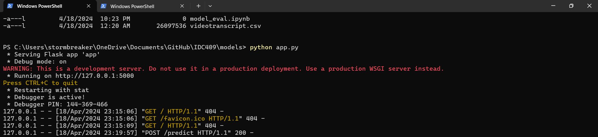
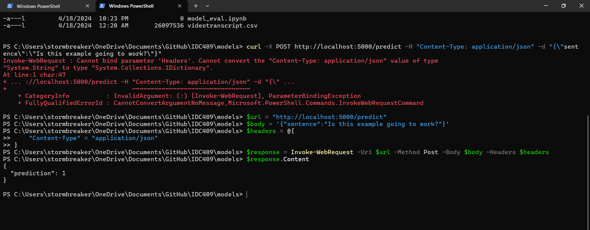

# Project Report: Question Detection Model

## Overview
This report outlines the development and deployment of a machine learning model designed to identify whether sentences from video transcripts are questions. The project includes data preprocessing, model training, API development, and dockerization for deployment.

## Data Preprocessing
Data preprocessing involved cleaning text data, encoding categorical labels, and preparing the data for model training. 

### Steps:
1. **Text Cleaning**: Lowercased all text, removed punctuation, and stripped whitespaces.
2. **Label Encoding**: Converted text labels into integers using `LabelEncoder`.

```python
from sklearn.preprocessing import LabelEncoder

data.drop(columns=data.columns[0], inplace=True)
data['sentence'] = data['sentence'].str.lower().str.replace(r'[^\w\s]', '', regex=True).str.strip()

label_encoder = LabelEncoder()
data['label'] = label_encoder.fit_transform(data['label'])
```

## Model Training
We utilized sentence embeddings and trained multiple models, selecting Logistic Regression based on its performance.

### Vectorization
 - Sentence Embeddings: Transformed sentences using the SentenceTransformer model.
 ```python
 from sentence_transformers import SentenceTransformer

model = SentenceTransformer('all-MiniLM-L6-v2')
sentence_embeddings = model.encode(data['sentence'].tolist())
 ```

### Model Selection
Logistic Regression was chosen due to its high performance on our dataset, evaluated using the AUC metric.

```python
from sklearn.linear_model import Logistic Regression
from sklearn.model_selection import train_test_split
from sklearn.metrics import roc_auc_score

X_train, X_test, y_train, y_test = train_test_split(sentence_embeddings, data['label'], test_size=0.2)
lr_model = LogisticRegression(max_iter=1000)
lr_model.fit(X_train, y_train)

```

## API Development

Developed a Flask API to serve predictions from the trained model. The API preprocesses input sentences, generates embeddings, and returns predictions.

```python
from flask import Flask, request, jsonify
import joblib

app = Flask(__name__)
lr_model = joblib.load('logistic_regression_model.pkl')
sentence_model = SentenceTransformer('all-MiniLM-L6-v2')
label_encoder = joblib.load('label_encoder.pkl')

@app.route('/predict', methods=['POST'])
def predict():
    data = request.get_json(force=True)
    cleaned_sentence = data['sentence'].lower().replace(r'[^\w\s]', '').strip()
    sentence_embedding = sentence_model.encode([cleaned_sentence])
    prediction = lr_model.predict(sentence_embedding)
    decoded_prediction = label_encoder.inverse_transform([int(prediction[0])])[0]
    return jsonify(prediction=decoded_prediction)

if __name__ == '__main__':
    app.run(debug=True)
```

## Dockerization
Containerized the Flask application using Docker to ensure consistent environments across different deployments.

### Dockerfile
```bash
FROM python:3.8-slim
WORKDIR /app
COPY . /app
RUN pip install --no-cache-dir -r requirements.txt
EXPOSE 5000
CMD ["python", "app.py"]
```

### Fetch the Docker Image

```bash
docker pull shivshankarsinghdocker/sentence-predictor:latest
docker run -d -p 5000:5000 shivshankarsinghdocker/sentence-predictor:latest
```


## Terminal Images

### Flask running



### Model doing prediction



